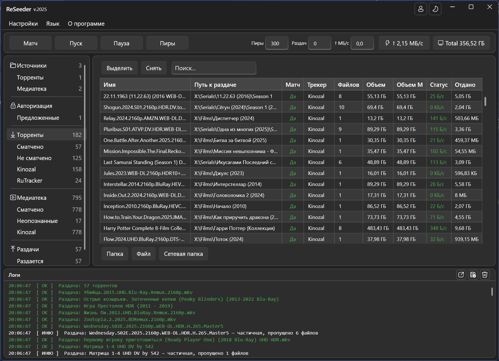
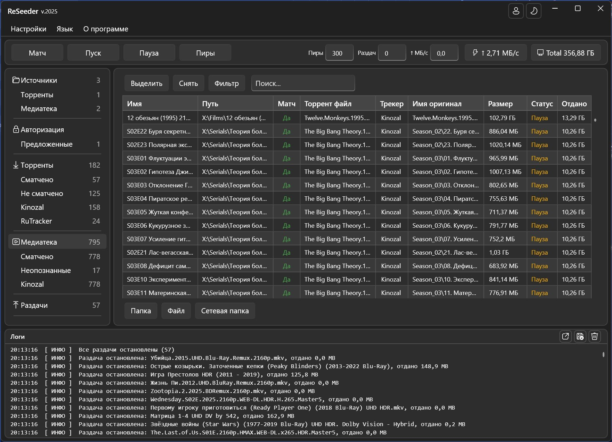
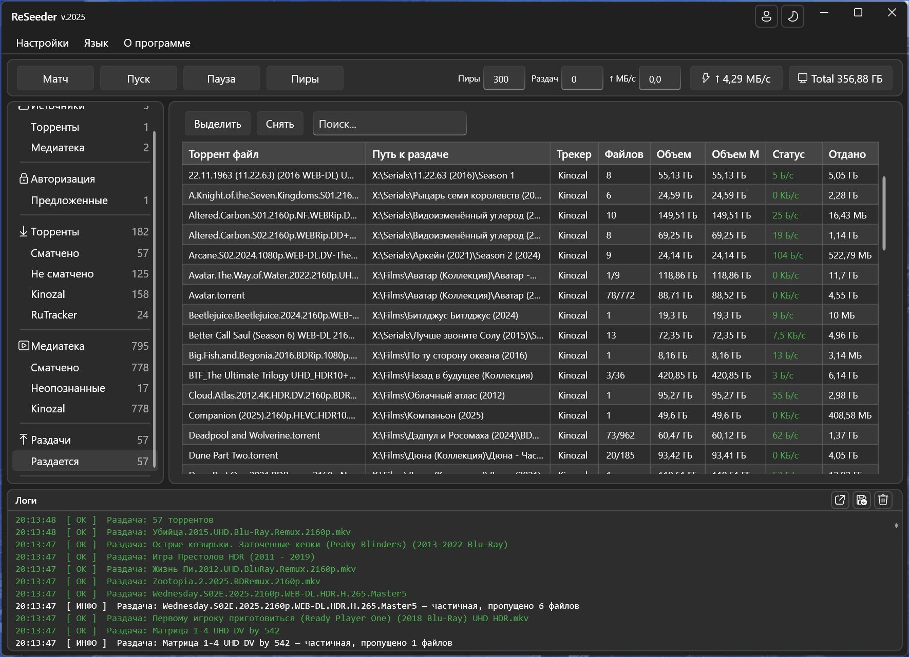
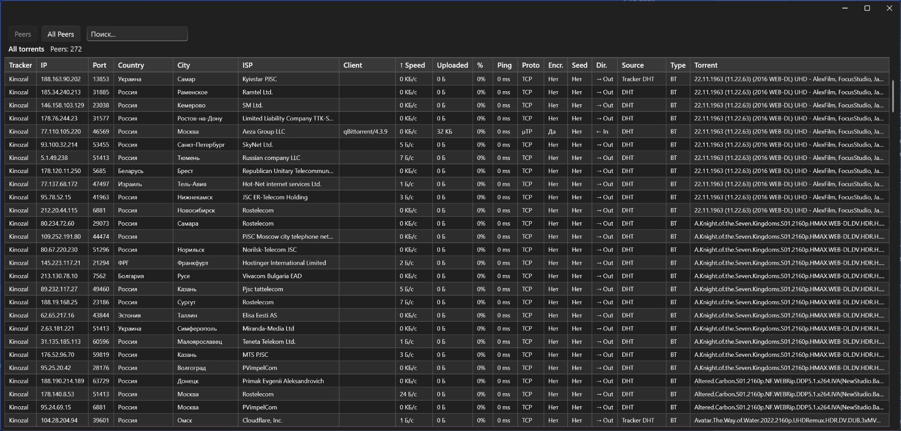

<picture>
  <source media="(prefers-color-scheme: dark)" srcset="assets/logo-dark.png">
  
</picture>

# ReSeeder

**Instant torrent seeding without rehashing**

[**Website**](https://reseeder.app) · [**Download**](https://reseeder.app) · [**Screenshots**](https://reseeder.app/screenshots.html) · [Русский](README.ru.md)

---

**ReSeeder** is a free Windows utility that instantly seeds movies and TV shows you already have on disk to **Kinozal**, **RuTracker** and other trackers — skipping hash checks. It finds already-downloaded files on your drive and starts seeding in **seconds** (cross-seeding existing data). No rehashing, no re-downloading.

> ℹ️ This repository is a **project showcase** — the application source code is not published here. Downloads and full details are at **[reseeder.app](https://reseeder.app)**.

## Features

- ⚡ **Instant cross-seeding** — put already-downloaded files back into seeding (cross-seed existing data) in seconds, without re-checking hashes.
- 🔎 **Finds renamed files** — matches your files to torrents even if they were renamed, by hashing only the first and last piece.
- 📦 **Seeds what you have** — seeds the files actually present on disk, no re-downloading.
- 🔗 **One file, multiple trackers** — a single local file can be seeded to several trackers at once.
- 🗂️ **Auto-sort by tracker** — automatically organizes your seeds per tracker.
- 🗺️ **Seeding map** — visual map of peers you are seeding to.
- 🛠️ **For tracker admins** — passkey and API support for tracker integration.

## Screenshots

| Torrents | Media library |
|:---:|:---:|
|  |  |

| Seeding | Peers map |
|:---:|:---:|
|  |  |

## Download

**Windows 10 / 11 (x64)** · Free · No .NET installation required (self-contained).

👉 **[reseeder.app](https://reseeder.app)**

## Links

- 🌐 Website — https://reseeder.app
- 🖼️ Screenshots — https://reseeder.app/screenshots.html
- 🧩 Tracker API — https://reseeder.app/trackers-api.html
- 🔒 Privacy — https://reseeder.app/privacy.html

---

© ReSeeder · Freeware for Windows · <a href="https://reseeder.app">reseeder.app</a>

